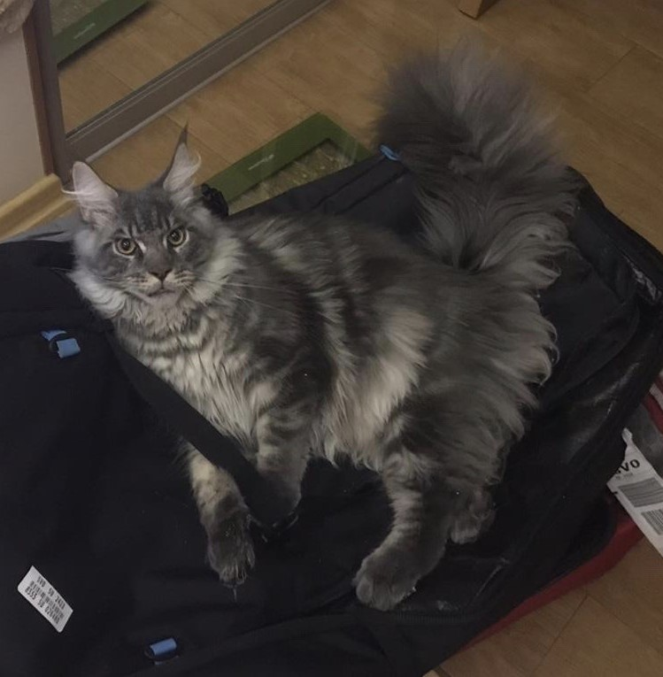

# Anya's User Page

## Table of Content
1. [General introduction](#general-introduction)
2. [Quote](#quote)
3. [Code](#code)
4. [Habits that I want to have](#good-habits-that-i-really-want)
5. [Pets](#pets)

## General introduction

Hi! My name is **Anya**. I am a second year **Computer Science** major. 
I am also an international student from Russia. I am most excited
about **Software Engineering**, **AI** and **Cybersecurity**. However, I still
don't know a lot of things, so I am very open to any learning opportunity
that comes my way. My interests (besides Computer Science) are different
types of sports like swimming and snowboarding, drawing and sketching,
traveling and trying out new hobbies in general.

## Quote

Even though I am a fan of inspirational quotes, I'm not too sure which one
to put here. 

> A place for an awesome quote.

However, the first thing that comes to my mind whenever
I think of a quote is [this](./linked.md).

## Code

The first lines of code I wrote here at UCSD one and a half years ago! :

```
name = input('Enter your name: ')
print("Hello, " + name + "! Welcome to CSE 8A!")
```


Stepik was a great learning resource for me: [link](https://stepik.org/course/125129/syllabus?auth=login)

## Good habits that I really want 
### but do not have discipline to maintain

- [ ] Draw/sketch
- [x] Do sports (*I'm actually doing it this quarter!*)
- [x] Time managment with a calendar (*Doing this too!*)
- [ ] **Maintain sleep routine**
- [ ] Read
- [ ] Do Leetcode
- [ ] Learn a foreign language
- [ ] Meditate

## Pets 

My family has 2 pets. They mean a lot to me so I thought that I would share about them on this page too:

- Vuka:



- Grisha:


