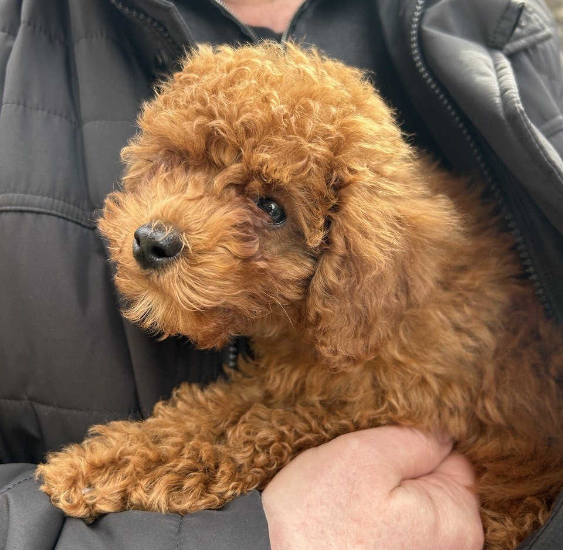

# Anya's User Page

## Table of Content
1. [General introduction](#general-introduction)
2. [Pets](#pets)

## General introduction

Hi! My name is Anya. I am a second year Computer Science major. 
I am also an international student from Russia. My interests 
(besides Computer Science) are different types of sports like
swimming and snowboarding, drawing and sketching, traveling 
and trying out new hobbies in general.

## Pets 

My family has 2 pets. They mean a lot to me so I thought that I would share about them on this page too:

- Vuka:

- Grisha:

